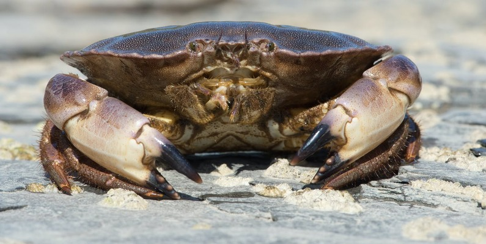

# [Crab Age prediction]((https://github.com/sana1410/Regression-Analysis/blob/main/CrabAgePrediction.ipynb))

### OBJECTIVE: -
Crab is widely regarded for its delicious taste, leading numerous countries globally to import substantial quantities of crabs annually for consumption. Crab farming offers significant advantages, notably low labor costs, relatively lower production expenses, and rapid growth rates. The expansion of commercial crab farming is positively impacting the livelihoods of coastal communities. With careful attention and effective management, profits from crab farming can surpass those from shrimp farming. 
The objective of this project is predict the age of the crabs based on the physical attributes like height , weight , Shell weight etc. . This model is going to help commercial crab farmer by knowing the right age of the crab which will help them  to decide if and when to harvest the crabs.
## Steps involved 
* Exploratory Data Analysis
* Feature Engineering
* Regression analysis
## Concepts Covered
* Python for Data Analysis
* Data Cleaning
* Machine Learning
* Feature Scaling
## Libraries Covered
* Pandas , Matplotlib, Seaborn, Scikit-learn
## Model Metrics 
R-squared value :-0.8617722089034628
RMSE value :-1.1800084215821767

