# Beijing Multi-Site Air-Quality Prediction
### OBJECTIVE: -
In this Project, we are going to perform linear regression to predict the air quality using data which we have taken from .
This data is from Beijing Municipal Environmental Monitoring Center which captures air quality data from nationally controlled air quality monitoring sites in city of Aotizhongxin.
We have used linear regression which is the statistical method for modeling the relationship between a dependent variable and one or more independent variables. The objective of linear regression is to find the best linear relationship between the dependent variable, which in our model is ‘PM2.5’ level and the independent variables like PM10 concentration, Sulfur dioxide, carbon monoxide, nitrogen oxides and volatile organic compounds present in air.
## Exploratory Data Analysis
### Descriptive Statistics
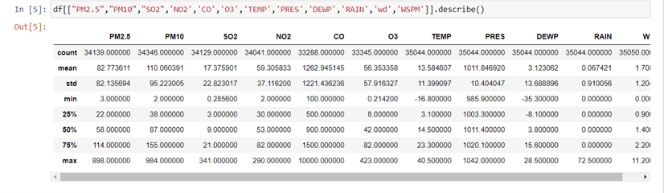
### Data Cleaning /Removing Null Values 
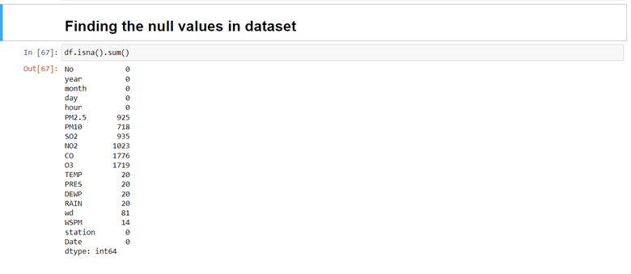
### Line Chart
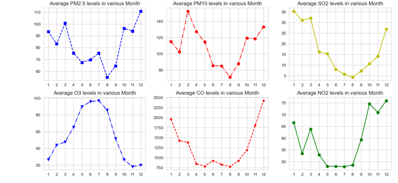
### Histograms
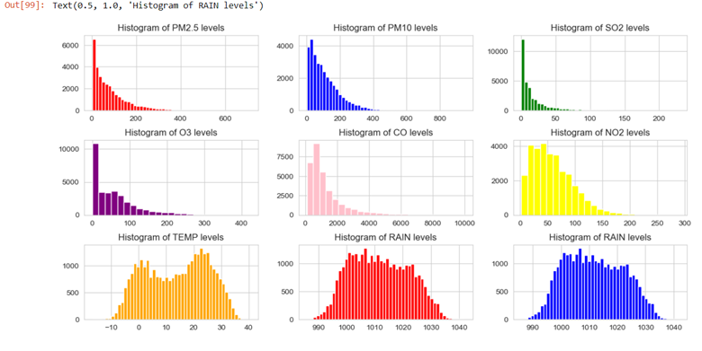
### Time Series Plot
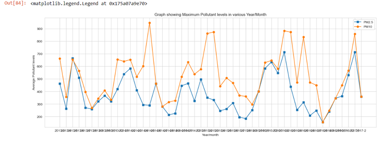
### Barplot
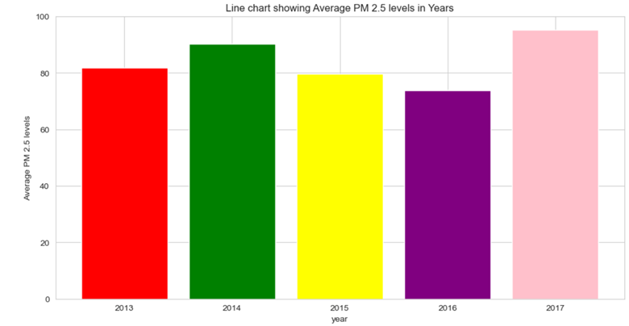
### Scatter Plots
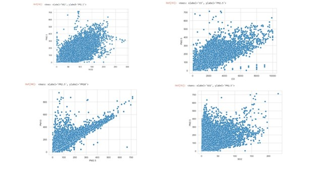
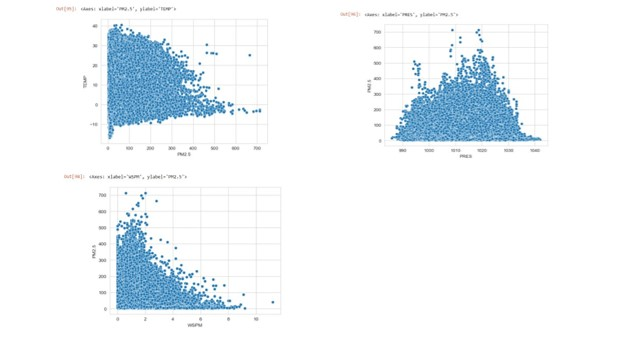
### Correlation Plot

## OBSERVATION: -
* PM2.5 level is highest in the year 2014.
* PM2.5 level increases with the fall of temperature.
* PM2.5 level decreases with decrease in wind speed.
* PM2.5 is highly correlated to PM10, SO2, NO2 and CO
## MODEL BUILDING: -
### SPLIT IN TRAIN AND TEST DATA: -
In machine learning models we generally split the data into training and testing. The main reasons for splitting the data are:
1.	Model Evaluation: We first build or fit the model on train data and check the performance of the model on test data.
2.	Overfitting Detection: Overfitting occurs when a model becomes too specialized in learning from the training data to the extent that it fails to generalize well to new data. By evaluating the model's performance on the testing dataset, you can detect if the model is overfitting. If the model performs well on the training set but poorly on the testing set, it suggests overfitting.
3.	Hyperparameter Tuning: Splitting the data allows you to tune the hyperparameters of your model. Hyperparameters are settings that are not learned from the data but are set manually before training. By evaluating the model's performance on the testing set for different hyperparameter settings, you can choose the best combination that maximizes.
4.	We will split the data into training and test.
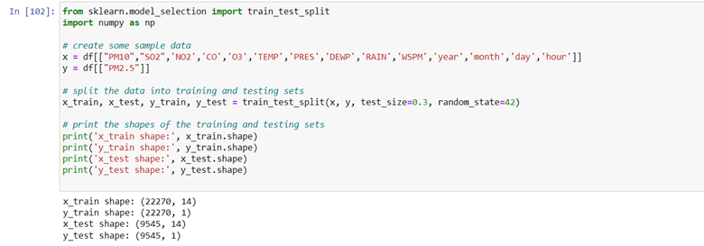
We will use LinearRegression function from sklearn.linear_model to build the model on train data and test it on test data.
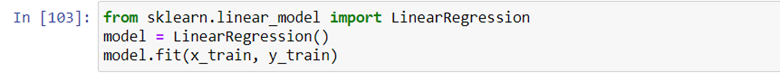
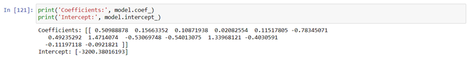
 
The R-squared value, also known as the coefficient of determination which is statistical measure that represents the percentage of the variance in the dependent variable i.e., PM2.5 that is explained by the independent variable (x) in a linear regression model is 0.85 
We will test our model using test data.
 
We will use RMSE value to test our model performance. 
`RMSE (Root Mean Squared Error)` is a commonly used evaluation metric for regression problems. It measures the average deviation of the predictions made by a regression model from the actual values in the dataset. The RMSE is calculated as the square root of the mean of the squared differences between the predicted and actual values.
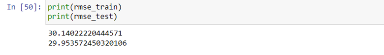
 
## CONCLUSIONS: -
The R-squared value can be increased by using more relevant independent variables. RMSE value indicates that the model performed better in test data as the RMSE value is less in test data.

